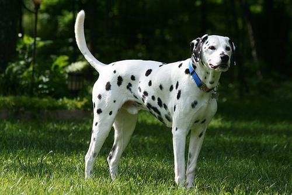

# Dog Breed Classification Project

## Project Overview

This project is part of Udacity's "AI Programming with Python" Nanodegree.  
The goal of this project is to classify images of dogs according to their breed, using transfer learning.

**_Example:_**  
**Input** =  

**Output** = Dalmatian
